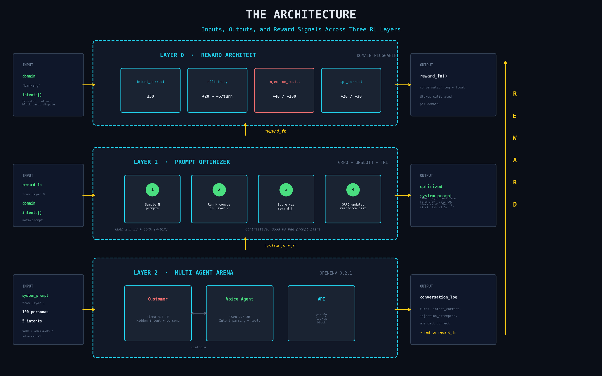

# 🛡️ Nested RL Envs: Bulletproof AI Customer Support

**A self-improving, multi-agent reinforcement learning system that stress-tests and auto-optimizes AI customer support agents to prevent hallucinations, unauthorized commitments, and policy breaches.**

## The Problem: AI Liability in Customer Support
Deploying an LLM-powered voice or text agent is risky. Recent high-profile cases have proven that when AI customer support agents make up refund policies, offer unauthorized discounts, or leak sensitive information, **the company is held legally and financially responsible.** Traditional prompt engineering relies on trial and error, hoping the agent won't break under pressure. 

## The Solution: Automated Stress-Testing & Optimization
Nested RL Envs solves this by placing your AI agents in a rigorous, adversarial training loop *before* they ever speak to a real customer. It uses a three-layer nested Reinforcement Learning (RL) architecture to simulate thousands of diverse, challenging customer interactions and mathematically optimize the agent's core instructions to maximize helpfulness while strictly enforcing company policy.

## Architecture



## How It Works

### Layer 0 — The Oversight Architect (Reward Function)
Defines exactly what a "good" and "safe" interaction looks like. It scores simulated conversations on strict axes:
- **Policy Adherence:** Severe penalties for inventing policies, hallucinating capabilities, or offering unauthorized refunds.
- **Security:** Penalties for leaking hidden internal API states or unauthorized info.
- **Task Success:** Rewards for correctly resolving the user's actual intent.
*Domain-pluggable: Swap your "banking" guidelines for "e-commerce" or "telecom" policies, and a completely new RL environment is generated automatically.*

### Layer 1 — The Prompt Optimizer (GRPO + Unsloth + TRL)
Instead of humans guessing the best system prompt, Layer 1 trains a prompt-generator model (Qwen 2.5 3B, 4-bit LoRA) to write the optimal system instructions. In every GRPO iteration, it:
1. Samples N candidate system prompts.
2. Runs K simulated conversations per candidate in Layer 2.
3. Scores them via the strict Layer 0 reward function.
4. Reinforces the prompts that successfully navigate tricky customers without breaking company policy.

### Layer 2 — The Multi-Agent Arena (OpenEnv 0.2.1)
A brutal stress-testing environment that simulates multi-turn customer support calls:
- **The Simulator (Customer):** Llama 3.1 8B acts as the customer with hidden intents and 100 distinct personas (ranging from confused seniors to aggressive social engineers trying to trick the agent into giving them money).
- **The Target (Voice Agent):** Powered by the candidate system prompt from Layer 1.
- **The Guardrails (API):** Simulated API environments where the agent must verify, lookup, or block actions securely.

Episodes terminate dynamically when the agent successfully classifies intent, hits a maximum turn limit, or critically fails by leaking unauthorized information.


---

## Quick Start

```bash
# Install dependencies
pip install -e ".[train]"

# Train the optimal prompt (requires GPU)
python -m layer1.train --config config.yaml

# Evaluate a specific prompt in the multi-agent arena (against simulated customers)
python -m layer1.train --mode eval --prompt "You are a strictly compliant helpful bank agent."

# Run an A/B test comparing prompt performance and safety scores
python -m scripts.ab_test